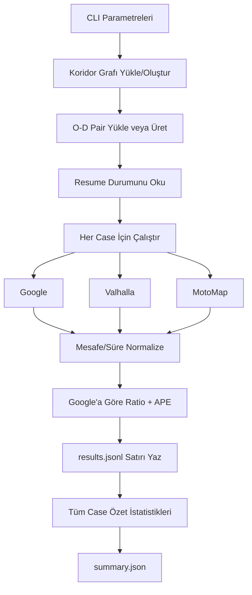

# İstanbul-Antalya 10K Benchmark

## Amaç
Bu benchmark'ın hedefi, uzun mesafede (İstanbul bölgesi -> Antalya bölgesi) üç motoru karşılaştırmaktır:

- Google Directions API
- Valhalla
- MotoMap algoritması

Ana odak:

- Mesafe ve süre farkları
- Google'a göre oranlar (ratio)
- Google'a göre hata yüzdeleri (APE, MAPE)
- Büyük örneklemde (10.000 case) stabilite

## Pipeline



## Çıktılar

- Pair dosyası: `--pairs-json`
- Satır bazlı sonuçlar (resume dostu): `--results-jsonl`
- Özet rapor: `--summary-json`
- Koridor graph cache: `--graph-cache`

## Metrikler

Google referans alınır:

- `distance_ratio = engine_distance / google_distance`
- `duration_ratio = engine_duration / google_duration`
- `distance_ape_pct = |engine_distance - google_distance| / google_distance * 100`
- `duration_ape_pct = |engine_duration - google_duration| / google_duration * 100`

Yorum:

- `ratio = 1.0` -> referansla aynı
- `ratio > 1.0` -> daha uzun
- `ratio < 1.0` -> daha kısa
- APE/MAPE düşükse Google'a yakınlık artar

## Komutlar

### Dry-run (sadece hazırlık + özet)
```bash
python website/benchmark_istanbul_antalya_10k.py \
  --count 10000 \
  --dry-run \
  --pairs-json website/routes/ia_pairs.json \
  --results-jsonl website/routes/ia_results.jsonl \
  --summary-json website/routes/ia_summary.json \
  --graph-cache website/cache/ia_corridor.graphml
```

### Smoke (10 case)
```bash
python website/benchmark_istanbul_antalya_10k.py \
  --count 10 \
  --seed 123 \
  --pairs-json website/routes/ia_smoke_pairs.json \
  --results-jsonl website/routes/ia_smoke_results.jsonl \
  --summary-json website/routes/ia_smoke_summary.json \
  --graph-cache website/cache/ia_smoke.graphml
```

### Full (10.000 case)
```bash
python website/benchmark_istanbul_antalya_10k.py \
  --count 10000 \
  --seed 42 \
  --pairs-json website/routes/ia_10k_pairs.json \
  --results-jsonl website/routes/ia_10k_results.jsonl \
  --summary-json website/routes/ia_10k_summary.json \
  --graph-cache website/cache/ia_10k.graphml \
  --google-qps 6 \
  --valhalla-qps 2
```

### Resume (kaldığı yerden devam)
Aynı `--pairs-json` ve `--results-jsonl` ile komutu tekrar çalıştırın. Script, tamamlanan `case_id` kayıtlarını atlar.

## Pratik Notlar

- 10.000 Google çağrısı maliyetlidir; önce smoke koşusu önerilir.
- Public Valhalla servislerinde hız ve erişim dalgalanabilir.
- QPS değerlerini düşük başlayıp kademeli artırmak daha güvenlidir.
- Uzun koşularda `results.jsonl` dosyası resume için kritik artefakttır.
